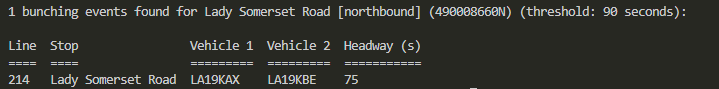
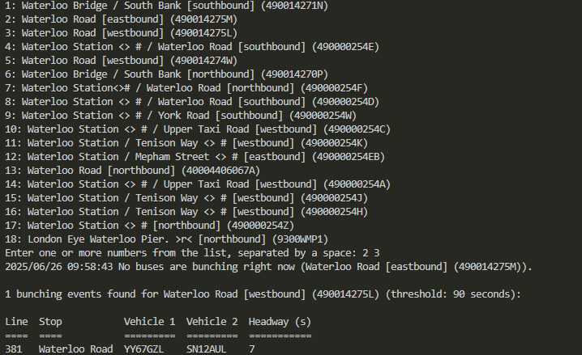
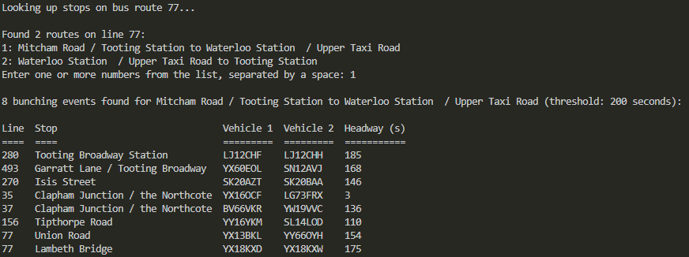

# 🚌 TfL Bus Bunching Detector

This command-line tool suite analyses live London bus arrival data to detect and report instances of bus bunching on specific routes or at specific stops. It uses the Transport for London (TfL) API to fetch real-time data and applies a configurable threshold to identify when buses are arriving too close together (bunching). It can also be set to run for a period of time, checking routes regularly for bunching events to identify when they are more likely to occur.

## ✨ Features
- **Real-time Analysis**: Detects bus bunching events for a given route or stop using live TfL data
- **Stop Search**: Allows searching for stops by name or Naptan ID
- **Route Analysis**: Supports analysis of specific bus lines/routes
- **Configurable Thresholds**: Adjustable bunching threshold (in seconds)
- **Interactive Output**: Tabular output of bunching events, including line, stop, vehicle IDs, and headway
- **Continuous Logging**: Periodic monitoring and CSV logging of bunching events for long-term analysis

## 🚀 Usage

The tool provides two main commands:

### 📊 Bunch Checker - One-time Analysis
```
go run ./cmd/bunch-checker/main.go [flags]
```

### 📝 Bunch Logger - Continuous Monitoring
```
go run ./cmd/bunch-logger/main.go [flags]
```

---

## 📊 Bunch Checker

The bunch checker performs a one-time analysis of bus bunching events and displays results in the terminal.

### 🏷️ Flags
- `-stop-id` (string): NaptanId for a specific stop (e.g. `-stop-id="490008660N"`)
- `-search` (string): Search for a stop by name (e.g. `-search="Waterloo"`)
- `-line` (string): Line ID or Line Number to analyse a whole route (e.g. `-line="77"`)
- `-threshold` (int): Threshold for bunched buses in seconds (default: 90)

At least one of `-stop-id`, `-search`, or `-line` must be provided.

### 💡 Examples
- Analyse bunching for a specific stop:
  ```
  go run ./cmd/bunch-checker/main.go -stop-id="490008660N"
  ```
  
- Search for stops by name and select interactively:
  ```
  go run ./cmd/bunch-checker/main.go -search="Waterloo"
  ```
  
- Analyse bunching for a whole bus route with a custom threshold:
  ```
  go run ./cmd/bunch-checker/main.go -line="77" -threshold=200
  ```
  

---

## 📝 Bunch Logger

The bunch logger continuously monitors bus lines for bunching events and logs them to a CSV file for long-term analysis.

### 🏷️ Flags
- `-lines` (string, required): Comma-separated list of bus lines to track (e.g. `-lines="77,205,N8"`)
- `-interval` (int): Interval between checks in minutes (default: 5)
- `-threshold` (int): Threshold for bunched buses in seconds (default: 90)
- `-select-routes` (bool): Set to `true` to interactively select specific routes on each line (default: false)

### 💡 Examples
- Monitor multiple bus lines with default settings:
  ```
  go run ./cmd/bunch-logger/main.go -lines="77,205,N8"
  ```
- Monitor with custom interval and threshold:
  ```
  go run ./cmd/bunch-logger/main.go -lines="77,205" -interval=10 -threshold=120
  ```
- Monitor specific routes on lines (interactive selection):
  ```
  go run ./cmd/bunch-logger/main.go -lines="77,205" -select-routes=true
  ```

### 📁 Output File
Logged bunching events are saved to: `internal/data/logged_bunching_events.csv`

The CSV file contains the following columns:
- **LineID**: The bus line identifier
- **StopID**: The Naptan ID of the stop
- **StopName**: The name of the stop
- **EventTime**: Timestamp of when the bunching was detected
- **Headway**: Time difference between bunched buses (in seconds)
- **VehicleIDs**: Pipe-separated list of vehicle identifiers involved in the bunching event

## ️ Requirements
- Go 1.18+
- A valid TfL API key (set in your config)

## ⚙️ Configuration

### 🔑 Getting a TfL API Key
1. Visit the [TfL API Portal](https://api-portal.tfl.gov.uk/signup) and sign up for a free account.
2. After registering and verifying your email, log in and create a new application to obtain your API key (app_key).

### 📝 Setting the API Key
1. Create a file named `.env` in the project root directory (next to `main.go`).
2. Add the following line to your `.env` file, replacing `YOUR_TFL_API_KEY` with your actual key:
   ```
   TFL_APP_KEY=YOUR_TFL_API_KEY
   ```
3. The application will automatically load this key from the `.env` file at startup.

If you prefer, you can also set the environment variable directly in your shell before running the app:
```
export TFL_APP_KEY=YOUR_TFL_API_KEY
```

The app requires this key to authenticate requests to the TfL API.

## 🗂️ Bus Stop Data

The application requires a list of all London bus stops in CSV format.

### Downloading the Data
1. Download the latest bus stop data from the official TfL source:
   [https://tfl.gov.uk/bus-stops.csv](https://tfl.gov.uk/bus-stops.csv)
2. Save the downloaded file as:
   `internal/data/bus-stops.csv`
   (relative to the project root directory)

This file is used by the application to look up and search for bus stops by name or ID.

## 📄 License
MIT
